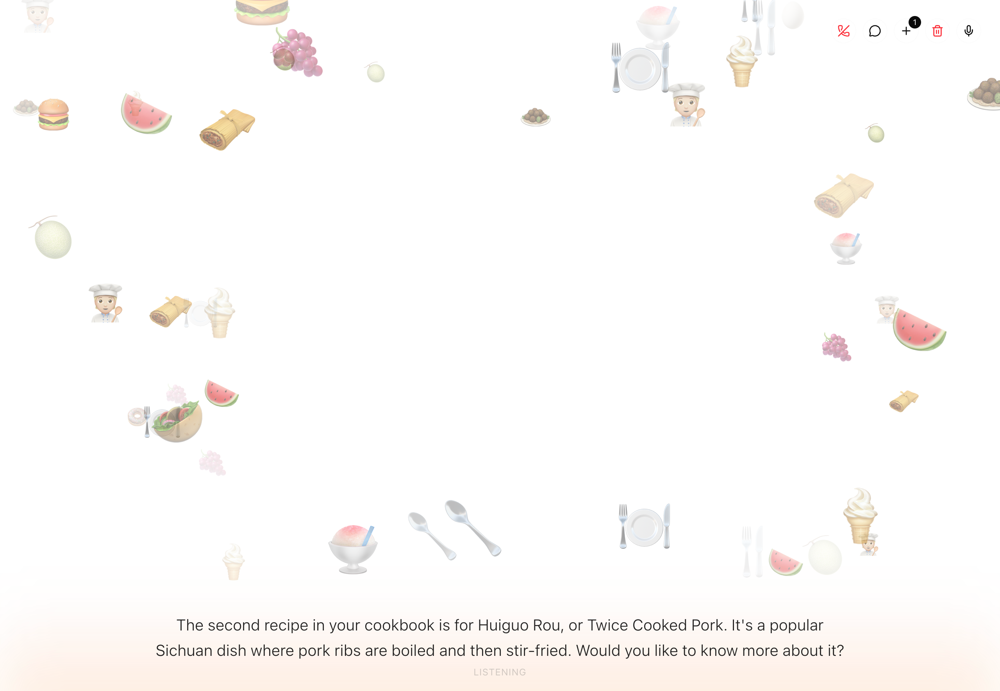
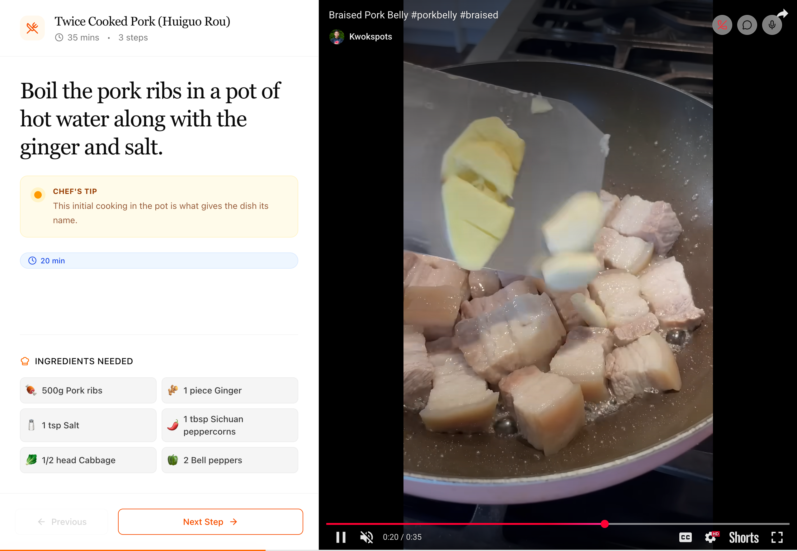
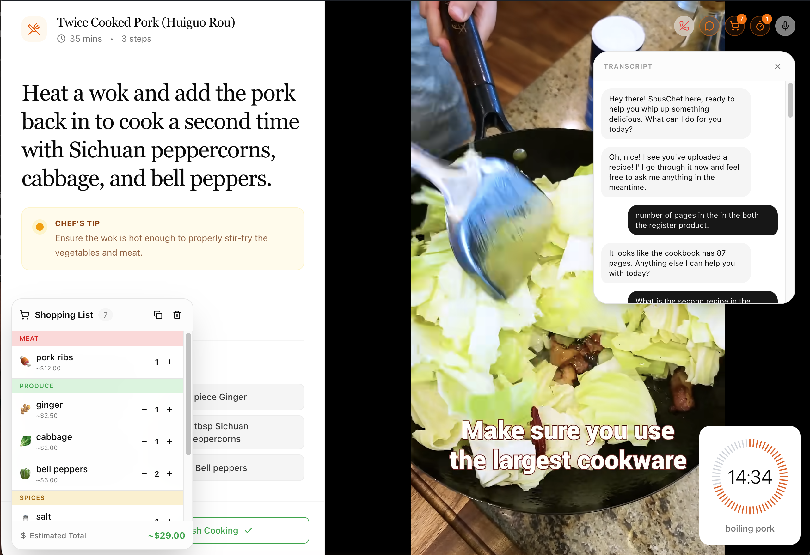

# SousChef AI 👨‍🍳

<p align="center">
  
</p>

A RAG-enabled voice cooking assistant built with LiveKit. Upload cooking PDFs or recipe images (grandma's handwritten recipes, cookbook photos), ask questions, get recipe advice, and have a natural conversation about food — all through voice!



---

## ✨ Immersive Cooking Mode

SousChef now features a dual-pane immersive mode that brings your recipes to life:
- **Guided Content**: Recipe steps and ingredients on the left.
- **Visual Aid**: Watch the recipe video or technique right on the same screen.
- **Smart Tools**: Timers and Shopping Lists auto-appear when needed.

| Recipe Guidance | Visual Immersion |
|:---:|:---:|
|  |  |


---

## 📖 Design Document

### System Architecture

```
┌─────────────────────────────────────────────────────────────────────────────┐
│                              Client Browser                                 │
│  ┌──────────────────────────────────────────────────────────────────────┐   │
│  │                     Next.js Frontend                                 │   │
│  │  - Voice selection (Male/Female/Neutral)                             │   │
│  │  - PDF & Image upload for RAG                                        │   │
│  │  - Real-time transcript display                                      │   │
│  │  - WebRTC audio streaming                                            │   │
│  └──────────────────────────────────┬──────────────────────────────────-┘   │
└─────────────────────────────────────┼───────────────────────────────────────┘
                                      │ WebSocket + WebRTC
                                      ▼
                         ┌────────────────────────┐
                         │    LiveKit Cloud       │
                         │  (Room Management)     │
                         │  - Audio routing       │
                         │  - Participant mgmt    │
                         └───────────┬────────────┘
                                     │ Worker Connection
                                     ▼
┌─────────────────────────────────────────────────────────────────────────────┐
│                           Python Agent (Local)                              │
│  ┌─────────────────────────────────────────────────────────────────────┐   │
│  │                      LiveKit Agents Framework                        │   │
│  │                                                                      │   │
│  │   ┌─────────┐      ┌───────────────────────────────────┐             │   │
│  │   │   VAD   │  ->  │    Gemini 2.5 Multi-modal Live    │             │   │
│  │   │ Silero  │      │  (Native Audio-to-Audio / RAG)    │             │   │
│  │   └─────────┘      └─────────────────┬─────────────────┘             │   │
│  │                                      │                               │   │
│  │          ┌───────────────────────────┼───────────────────────────┐   │   │
│  │          ▼                           ▼                           ▼   │   │
│  │   ┌─────────────-┐             ┌─────────────┐            ┌─────────────┐│
│  │   │Agentic Vision│             │  RAG Engine │            │ Gemini Embed││
│  │   │(Gemini 3.0 F)│             │(LlamaIndex) │            │  dings 001  ││
│  │   └─────────────-┘             └─────────────┘            └─────────────┘│
│  └──────────────────────────────────────┴───────────────────────────────────┘│
└─────────────────────────────────────────────────────────────────────────────┘
```

### End-to-End Flow

1. **User Opens App** → Frontend runs locally (or on a static host)
2. **Voice Selection** → User picks Male/Female/Neutral voice and enters Gemini API key
3. **Recipe Ingestion** → User uploads PDF or snaps a photo of a recipe
4. **OCR (if image)** → Gemini Vision extracts text from images and saves as `.txt`
5. **Room Creation** → Frontend calls `/api/token` which creates a LiveKit room
4. **Agent Joins** → Python agent (Local) receives job from LiveKit Cloud and joins the room
5. **Voice Capture** → Browser captures microphone audio via WebRTC
6. **VAD (Voice Activity Detection)** → Silero detects when user is speaking
7. **Multi-modal Processing** → Gemini 2.5 Flash native Live API processes audio and generates responses
8. **RAG Query** → If relevant, LLM uses `search_cookbook` tool to query the vector store
9. **Native Audio Output** → Gemini generates natural speech directly (native audio-to-audio)
10. **Audio Playback** → Audio streams back to browser via WebRTC

The RAG (Retrieval-Augmented Generation) pipeline allows users to upload cooking PDFs or snap photos of recipes:

```
PDF/Image Upload → [OCR (Gemini)] → Chunking → Embedding (Gemini) → LlamaIndex → Query → Context Injection → LLM
```

**Implementation:**

1. **Document Upload**: User uploads PDF or Image via frontend → saved to `/agent/data/`
   - **PDFs**: Stored directly
   - **Images**: Automatically processed via **Gemini 3.0 Flash Vision** to extract text, saved as `.txt`
2. **Ingestion (LlamaIndex)**:
   - Documents parsed with `SimpleDirectoryReader` (supports `.pdf` and `.txt`)
   - Text chunked using `SentenceSplitter` (chunk_size=512, overlap=50)
   - Chunks embedded using **Gemini Embedding 001** (or 004)
3. **Vector Storage**:
   - Embeddings stored in an in-memory or serverless index
   - Optimized for per-session recipe retrieval
4. **Query Flow**:
   - User asks cooking question
   - Keywords detected (recipe, cook, ingredient, etc.)
   - Query embedded and searched in Pinecone (top_k=3)
   - Retrieved context injected into LLM conversation
5. **RPC Integration**:
   - Frontend calls `reload_cookbook` RPC after upload
   - Agent re-indexes in background thread (non-blocking)
   - Agent verbally confirms when indexing completes

### Agent Tools

The agent has built-in function tools that the LLM intelligently decides when to use:

| Tool | Usage | UI Feedback |
|------|-------|-------------|
| **search_cookbook** | Queries uploaded PDFs for recipes/info | Context woven into response |
| **set_timer** | "Set a 10 minute timer for pasta" | Circular timer display (bottom-right) |
| **clear_timers** | "Cancel the timer" | Removes all active timers |
| **add_to_shopping_list** | "Add eggs, butter, milk to my list" | Floating shopping list (bottom-left) |
| **remove_from_shopping_list** | "I already have eggs" | Item removed from list |
| **clear_shopping_list** | "Clear my shopping list" | List emptied |
| **reload_cookbook** | Triggered after PDF/Image upload | Agent confirms verbally |

**Tool Architecture:**
- Tools are `@function_tool()` decorated methods on the Agent class
- LLM reads docstrings to understand when to call each tool
- Data sent to frontend via LiveKit data channel for real-time UI updates
- Shopping list includes AI-inferred categories and emojis

### Tools & Frameworks

| Category | Technology | Purpose |
|----------|------------|---------|
| **Voice Agent** | LiveKit Agents SDK | Real-time voice infrastructure |
| **VAD** | Silero VAD | Detect speech activity |
| **Multi-modal AI** | **Gemini 2.5 Flash** | Native audio-to-audio & vision |
| **RAG Framework** | LlamaIndex | Document ingestion and querying |
| **OCR / Vision** | Gemini 2.0 Flash | Image-to-text for handwritten recipes |
| **Embeddings** | Gemini Embedding 001 | High-performance vectorization |
| **Frontend** | Next.js 14 + React 18 | Web application |
| **Styling** | Tailwind CSS + Framer Motion | UI and animations |
| **Local Hosting** | `uv` (Python) / `npm` (Node) | Local development environment |
| **Real-time Infra** | LiveKit Cloud | WebRTC room management |

---

## 🚀 Setup Instructions

### Prerequisites

- Python 3.11+ with [`uv`](https://github.com/astral-sh/uv) package manager
- Node.js 18+ with `npm`
- [LiveKit Cloud](https://cloud.livekit.io) account
- [Google AI Studio Key](https://aistudio.google.com/app/apikey) (Gemini)

### Option 1: Run Locally

#### 1. Clone the Repository

```bash
git clone https://github.com/prxshetty/SousChefAI.git
cd SousChefAI
```

#### 2. Setup Agent

```bash
cd agent

# Copy environment template
cp .env.example .env.local

# Edit .env.local with your API keys:
# - LIVEKIT_URL, LIVEKIT_API_KEY, LIVEKIT_API_SECRET
# - GOOGLE_API_KEY (Gemini Key)

# Install dependencies and run
uv sync
uv run python main.py dev
```

#### 3. Setup Frontend

```bash
cd frontend

# Copy environment template
cp .env.example .env.local

# Edit .env.local with same LiveKit credentials

# Install and run
npm install
npm run dev
```

#### 4. Use the App

Open [http://localhost:3000](http://localhost:3000), select a voice, and start talking!

### Deployment (Optional)

While designed for local use during the workshop, the frontend can be deployed to platforms like **Vercel** or **AWS Amplify**. The Python agent requires an environment capable of maintaining an active connection to LiveKit Cloud (any VPS or local machine).

---

## Project Structure

```
SousChef AI/
├── agent/                     # Python voice agent
│   ├── main.py               # Agent entry point, session handling
│   ├── rag.py                # LlamaIndex + Pinecone RAG logic
│   ├── data/                 # Uploaded PDFs (gitignored)
│   ├── .env.example          # Environment template
│   └── pyproject.toml        # Python dependencies
│
├── frontend/                  # Next.js frontend
│   ├── app/
│   │   ├── page.tsx          # Main voice interface
│   │   ├── api/token/        # LiveKit token generation
│   │   └── api/upload/       # PDF upload handler
│   ├── components/ui/hero/   # Voice UI components
│   ├── next.config.js        # Next.js config (env vars)
│   └── .env.example          # Environment template
│
└── README.md                  # This file
```

---

## Design Decisions & Assumptions

### Trade-offs & Limitations

| Decision | Trade-off | Reasoning |
|----------|-----------|-----------|
| **Gemini Live API** vs Legacy Pipeline | Ultra-low latency native audio-to-audio | Faster, more natural responses; single API provider |
| **Local Agent Hosting** | Requires local machine to be on | Simplifies RAG document management and audio processing |
| **In-Memory / Pinecone** | Local dev speed vs managed scaling | Efficient session-based storage |
| **Per-session RAG clearing** | User must re-upload each session | Prevents data leakage between users; simplifies auth |
| **Multiple PDFs per session** | All uploads accumulated and re-indexed together | Users can query across multiple cookbooks within a session |

### Hosting Assumptions

- **Frontend**: Local hosting (preferred) or static host (Amplify/Vercel)
- **Agent**: Local machine execution via `uv`
- **Real-time Infra**: LiveKit Cloud (Managed WebRTC)

### RAG Assumptions

| Aspect | Choice | Rationale |
|--------|--------|-----------|
| **Vector Strategy** | LlamaIndex In-Memory | Superior performance for session-based single-cookbook usage |
| **Embedding Model** | Gemini Embedding 001 | Native integration, very high performance |
| **Chunk Size** | 512 tokens | Balances context preservation with retrieval precision |
| **Chunk Overlap** | 50 tokens | Prevents losing context at chunk boundaries |
| **Top-K Results** | 3 | Enough context without overwhelming LLM |
| **Retrieval Trigger** | Keyword detection | Simple heuristic; could upgrade to semantic intent detection |

### LiveKit Agent Design

- **Agent Registration**: Agent registers with LiveKit Cloud on startup; dispatched when room is created
- **Voice Metadata**: Room name encodes voice preference (`souschef-male-*` or `souschef-female-*`)
- **RPC Methods**: Frontend can call agent functions (`reload_cookbook`, `clear_cookbook`) via LiveKit RPC
- **Session Isolation**: Each user session gets its own room; cookbook cleared on disconnect
- **Non-blocking Indexing**: PDF indexing runs in background thread so agent remains responsive

---


## License

MIT License - feel free to use and modify!
